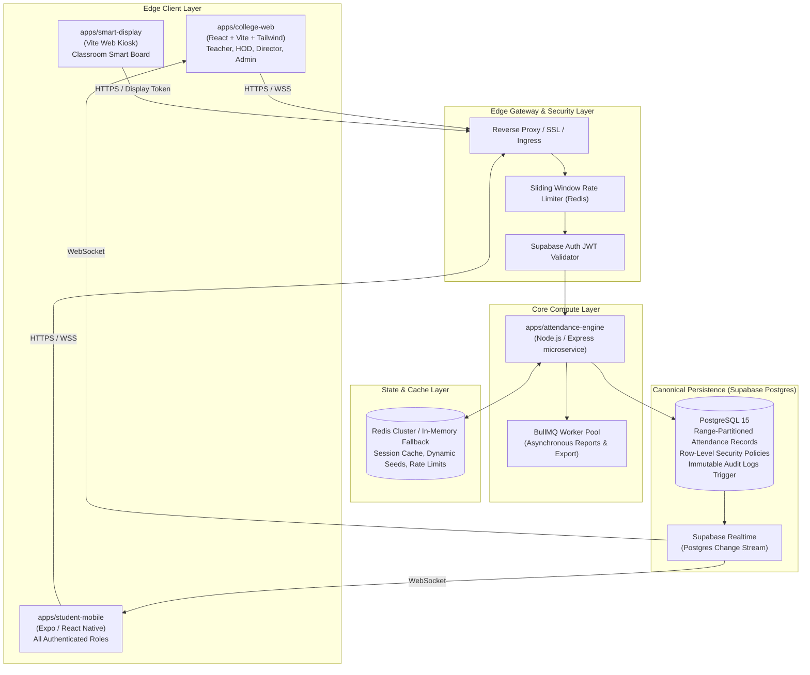

# CampusAttend OS - High-Level System Architecture

## 1. System Vision & Architecture Overview
**CampusAttend OS** is an enterprise-grade automated college attendance and institutional management system designed to eliminate queue congestion, attendance fraud, manual roll calls, and institutional data silos.

The platform employs a decoupled, multi-client monorepo architecture communicating with a centralized, security-hardened backend powered by **Supabase PostgreSQL 15**, **Row Level Security (RLS)**, **Supabase Realtime**, **High-Throughput Redis Caching**, and an **Express/Node.js Attendance Engine**.



---

## 2. Monorepo Structure (`apps/` & `packages/`)
The repository is managed via standard npm workspaces:

```
├── apps/
│   ├── attendance-engine/   # High-throughput attendance check-in, load-testing, reports & device auth
│   ├── college-web/         # Enterprise ERP dashboard (Teacher, HOD, Director, Super Admin, IT Admin)
│   ├── smart-display/       # Classroom smart board kiosk displaying real-time dynamic QR & headcounts
│   └── student-mobile/      # Universal Expo/React Native mobile app for all 5 authenticated roles
├── packages/
│   ├── attendance-sdk/      # Cryptographic HMAC-SHA256 dynamic QR generation & drift verification
│   ├── shared-types/        # Canonical TypeScript types, database interfaces, and role definitions
│   └── validation/          # Shared Zod schemas for forms, check-ins, reports, and timetable slots
├── docs/                    # Complete production documentation suite (13 guides)
└── supabase/
    └── migrations/          # 5 verified SQL migrations (Schema, RLS, Engine, Hardening, Reports)
```

---

## 3. The 3 Core Client Applications & Feature Parity

| Feature Dimension | Desktop Web (`college-web`) | Mobile Web (`college-web`) | Native Mobile (`student-mobile`) | Smart Board (`smart-display`) |
| :--- | :--- | :--- | :--- | :--- |
| **Primary Target** | Laptop / Desktop monitors | Mobile browser view | Android & iOS smartphones | Promethean, ViewSonic, Android TV |
| **Authentication** | Supabase Auth (Email / Password) | Supabase Auth | Supabase Auth + Biometrics ready | Hardware Token (`x-display-token`) |
| **QR Generation** | Faculty controls & session preview | Responsive session controls | Faculty mobile session controls | High-contrast animated SVG QR |
| **QR Scanning** | N/A (Admin/Teacher workstation) | Web camera scan fallback | Hardware-accelerated Camera API | N/A (Display only) |
| **Live Headcount** | Real-time Supabase Realtime channel | Real-time WebSocket sync | Real-time WebSocket sync | 2-second polling feed + WebSockets |
| **Leave & Adjustments** | Comprehensive approvals & reviews | Full mobile approval workflows | Student submission + file upload | N/A |
| **Timetable Sync** | Drag-and-drop timetable scheduler | Schedule calendar & day views | Daily/Weekly role timetable view | Displays active scheduled course |
| **Report Generation** | Multi-format PDF / Excel / CSV | On-demand report triggers | Student/Faculty report summaries | N/A |

---

## 4. Attendance Engine Architecture & Concurrency Defense
Traditional systems fail when hundreds of classes start simultaneously at 10:00 AM because of:
1. Global database locks on central tables.
2. Single global WebSocket channels overwhelming message brokers.
3. Slow database transactions per student scan.

CampusAttend OS resolves this with a **zero-lock, multi-tiered concurrency architecture**:

1. **Pre-Warmed Redis Cache:** When faculty starts a session, metadata (secret seed, classroom ID, section ID, active state) is pre-warmed into Redis.
2. **Cryptographic HMAC Offloading:** Student check-in requests verify the HMAC-SHA256 signature and 15-second time window (±1 drift window) in the application layer before touching PostgreSQL.
3. **Atomic Upsert Transaction:** PostgreSQL check-in is executed via an atomic stored procedure (`rpc_submit_qr_attendance`) with a strict `UNIQUE(session_id, student_id)` constraint, making concurrent duplicate scans completely idempotent.
4. **Isolated Realtime Channels:** Live headcount notifications are published to per-session broadcast channels (`session:<session_id>`), eliminating cross-classroom pub/sub noise.
5. **Background Asynchronous Reports:** Intensive analytics and institutional report generation are offloaded to **BullMQ** workers, guaranteeing that the attendance API remains sub-50ms even during institutional reporting runs.
