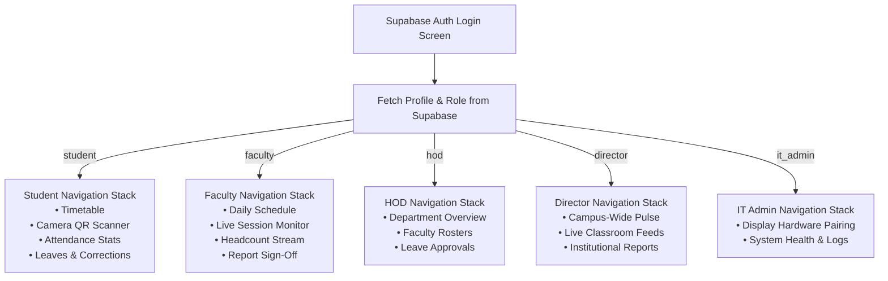

# CampusAttend OS - Native Mobile Application Guide

## 1. Universal Multi-Role Architecture
`apps/student-mobile` is built using **Expo SDK 51**, **React Native 0.74**, and **TypeScript**. 

Rather than deploying separate apps for students and faculty, CampusAttend OS uses a single, unified codebase featuring dynamic, role-based navigation:



---

## 2. Hardware Camera Scanner Integration
The mobile app leverages `expo-camera` to deliver real-time, hardware-accelerated QR scanning:
- Operates at 60 FPS scanning capability.
- Implements anti-glare high-contrast edge detection for reading 86" classroom displays from 15+ meters away.
- Enforces device biometric security and unique hardware fingerprint generation (`expo-device` / `expo-application`).

---

## 3. Expo & EAS (Expo Application Services) Configuration

The application is configured in `apps/student-mobile/eas.json`:

```json
{
  "cli": {
    "version": ">= 10.0.0"
  },
  "build": {
    "development": {
      "developmentClient": true,
      "distribution": "internal"
    },
    "preview": {
      "distribution": "internal",
      "android": {
        "buildType": "apk"
      }
    },
    "production": {
      "android": {
        "buildType": "app-bundle"
      },
      "ios": {
        "simulator": false
      }
    }
  },
  "submit": {
    "production": {}
  }
}
```

---

## 4. Build Commands & Artifact Generation

Run these commands from `apps/student-mobile/`:

### A. Local Development Client (Expo Go or Dev Client)
```bash
# Start Metro bundler with QR code for physical devices
npm run start

# Run on connected Android device/emulator
npm run android

# Run on iOS simulator (macOS required)
npm run ios
```

### B. Android Standalone APK (Internal Testing / Sideloading)
```bash
# Build standalone test APK using EAS Cloud
eas build --platform android --profile preview

# Or build locally using Gradle (requires Android SDK & JDK 17):
npx expo run:android --variant release
```

### C. Android Production App Bundle (Google Play Store AAB)
```bash
# Compile signed production AAB
eas build --platform android --profile production
```

### D. iOS Production Build (Apple App Store / TestFlight)
```bash
# Compile signed iOS archive (.ipa) for distribution
eas build --platform ios --profile production
```

> [!NOTE]
> All build commands above are fully valid EAS CLI invocations. For CI/CD automation, store `EXPO_TOKEN` as a pipeline secret.
